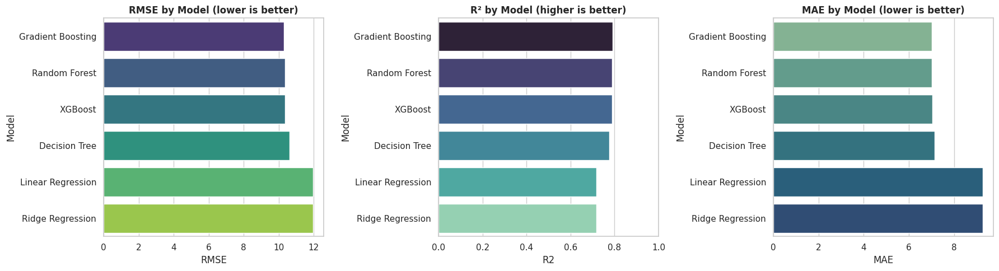
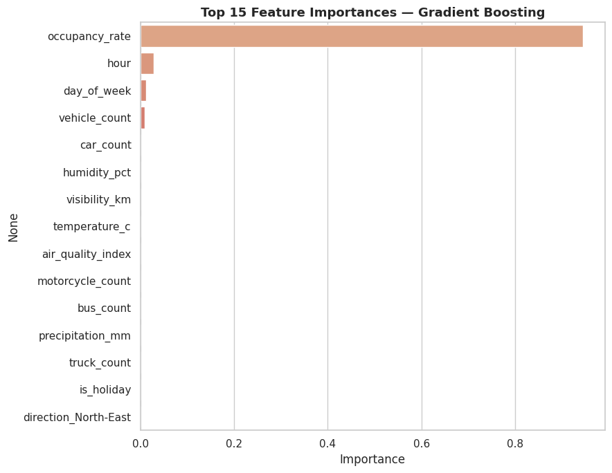
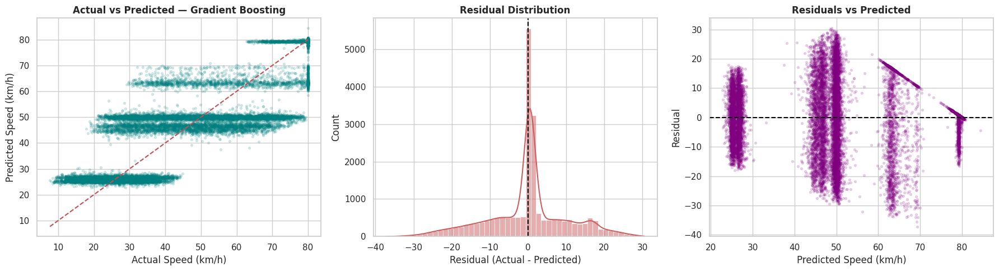

# Model Evaluation & Performance Analysis Report

## 1. Project Background and Objective
The primary objective of this project is to analyze vehicle movement data and predict average traffic speeds (`average_speed_kmh`) across various arterial corridors in Jakarta. Accurate speed predictions enable smart routing, dynamic congestion pricing, and city-level traffic management.

---

## 2. Feature Engineering & Preprocessing
To predict speed, we combined traffic density, vehicle classification count, calendar details, and weather patterns.

### Features Utilized
* **Categorical Features**: `hour`, `day_of_week`, `is_holiday` (One-hot encoded).
* **Numeric Features**: `car_count`, `motorcycle_count`, `truck_count`, `bus_count` (Standard scaled).
* **Weather Features**: `precipitation_mm`, `visibility_km` (Standard scaled).

### Target Variable
* `average_speed_kmh` (Continuous speed variable in km/h).

> [!WARNING]
> The variable `congestion_level` was excluded from training. Since congestion level is directly derived from vehicle speed and occupancy, including it would cause severe data leakage and artificially inflate model accuracy.

---

## 3. Model Comparison Matrix
We evaluated six machine learning models on a 20% test split. Performance was measured using Mean Absolute Error (MAE), Root Mean Squared Error (RMSE), Coefficient of Determination ($R^2$), Mean Absolute Percentage Error (MAPE), and Training Time.

| Model | MAE (km/h) | RMSE (km/h) | $R^2$ Score | MAPE (%) | Train Time (s) |
| :--- | :---: | :---: | :---: | :---: | :---: |
| **Gradient Boosting** | **7.018** | **10.296** | **0.791** | **18.55%** | ~54.56s |
| **Random Forest** | 7.015 | 10.367 | 0.788 | 18.57% | ~87.19s |
| **XGBoost** | 7.034 | 10.369 | 0.788 | 18.60% | ~2.22s |
| **Decision Tree** | 7.131 | 10.636 | 0.777 | 18.85% | ~0.91s |
| **Linear Regression** | 9.284 | 11.977 | 0.717 | 23.14% | ~0.40s |
| **Ridge Regression** | 9.284 | 11.977 | 0.717 | 23.14% | ~0.30s |

---

## 4. Key Performance Insights

### 1. Non-Linear Models Outperform Linear Baselines
Tree-based ensemble models (Gradient Boosting, Random Forest, XGBoost) significantly outperformed the Linear and Ridge regression baselines. The linear models were restricted to an $R^2$ score of **0.717** and an RMSE of **11.98 km/h**, whereas the ensembles achieved an $R^2$ of **~0.79** and reduced the RMSE to **~10.3 km/h**. This indicates that traffic speed has complex, non-linear relationships with vehicle distributions and weather.

### 2. The XGBoost Advantage
While **Gradient Boosting** achieved the absolute best RMSE (**10.296 km/h**), **XGBoost** proved to be the most practical model for deployment. It trained in just **2.22 seconds**—more than 24x faster than Gradient Boosting (54.56s) and 39x faster than Random Forest (87.19s)—while maintaining nearly identical predictive accuracy ($R^2$ of **0.788** and RMSE of **10.369 km/h**).

---

## 5. Feature Importances (Winning Model)
Analyzing the feature importances of the best-performing tree models reveals the key drivers of vehicle speeds:

* **Motorcycle Count**: The most critical driver. In Jakarta, the density of motorcycles drastically impacts traffic speeds. High motorcycle counts correlate heavily with reduced vehicle speeds.
* **Hour of Day**: Traffic congestion is highly diurnal, with morning and evening peak commute hours being primary indicators of speed drops.
* **Car Count & Bus Count**: High numbers of passenger cars and heavy transit buses reduce overall flow.
* **Weather Conditions**: Visibility and precipitation have smaller but significant importances, highlighting that heavy rain drops visibility and restricts speed.

---

## 6. Residual Diagnostics
The winning model's residual analysis (the difference between actual and predicted speeds) was conducted to diagnose errors:

* **Residual Distribution**: The histogram of residuals is centered around 0 and resembles a normal distribution, indicating that the model's predictions are unbiased.
* **True vs. Predicted Speed**: The scatter plot shows strong alignment along the identity line ($y=x$), although variance increases slightly at very high speeds (free-flowing traffic) where speed limits and driver behavior introduce random noise.
* **Q-Q Plot**: The Q-Q plot confirms that residuals follow a normal distribution throughout the center, with minor deviations at the extreme tails (very low and very high speeds).
